# MVP: Анализ и Сверка Доверенностей

Данный проект представляет собой полнофункциональное веб-приложение для автоматического извлечения данных из сканов доверенностей (PDF) и их кросс-валидации со структурированными заявлениями (XML).

Проект использует локальные нейросети (Vision-модели через Ollama) для обеспечения полной конфиденциальности данных.

---

## 🏗 Архитектура приложения

Приложение построено на клиент-серверной архитектуре **Node.js + TypeScript + React** для фронтенда и **Python (FastAPI)** для бэкенда. Логика обработки разделена на трех независимых "Агентов".

```mermaid
flowchart TD
    subgraph Frontend["Frontend (React + Vite + Tailwind)"]
        UI["Пользовательский интерфейс"]
        DragDrop["Загрузка XML и PDF"]
        Modal["Просмотр оригинала PDF"]
        Report["Отчет о сверке"]

        UI --> DragDrop
        UI --> Modal
        UI --> Report
    end

    subgraph Backend["Backend (FastAPI)"]
        API["POST /api/analyze"]
        A1["Агент 1: Парсер XML"]
        A2["Агент 2: Vision LLM"]
        A3["Агент 3: Модуль Валидации"]

        API --> A1
        API --> A2
        A1 -- "Массив заявлений (JSON)" --> A3
        A2 -- "Извлеченные данные (JSON)" --> A3
        A3 -- "Статус валидации и детали" --> API
    end

    subgraph AI["Local AI (Ollama)"]
        Qwen["Qwen3-VL:30B"]
    end

    DragDrop <==>|"Файлы по HTTP"| API
    A2 <==>|"Запрос с картинками (Base64)"| Qwen
```



---

## 🤖 Роли Агентов

Процесс анализа полностью автоматизирован благодаря цепочке из трех агентов:

1. **Агент 1 (XML Parser)**
   - Принимает `.xml` файл, содержащий массив заявлений от клиентов.
   - С помощью `xmltodict` конвертирует сложное XML-дерево в плоский список JSON-объектов.
   - Обеспечивает нормализацию данных для дальнейшей работы.

2. **Агент 2 (Vision LLM)**
   - Отвечает за анализ PDF. С помощью `PyMuPDF` конвертирует страницы доверенности в высококачественные изображения.
   - Отправляет изображения локальной Vision-модели (по умолчанию `qwen3-vl:30b`) через совместимый OpenAI API.
   - **Извлекаемые поля:** Наименование/ФИО доверителя, ИНН доверителя, ОГРН доверителя, Доверенное лицо, дата выдачи, срок действия, список полномочий и нотариус.

3. **Агент 3 (CrossValidator)**
   - Получает данные от Агентов 1 и 2.
   - Осуществляет **строгое сравнение** (поиск точного подстрочного совпадения).
   - Проходит по всему списку XML-заявлений и ищет ту запись, которая максимально соответствует данным из PDF.
   - Выдает вердикт о совпадении (Match / Mismatch) и детализацию по каждому проверенному полю.

---

## 💻 Технологический стек

- **Фронтенд:**
  - Vite
  - React + TypeScript
  - TailwindCSS (для UI, анимаций, стилизации)
  - Lucide React (для иконок)
- **Бэкенд:**
  - FastAPI (REST API, Pydantic)
  - PyMuPDF (`fitz`) - работа с PDF
  - `xmltodict` - парсинг XML
  - `openai` sdk - общение с Ollama
- **AI Модели:**
  - Ollama (локальный инференс)
  - `qwen3-vl:30b` (Vision-модель для распознавания текста и смысла с изображений)

---

## 🚀 Инструкция по запуску

Приложение разделено на 2 независимые части, которые должны работать параллельно.

### 1. Запуск Backend-сервера
В первом окне терминала:
```bash
cd backend
pip install -r requirements.txt
uvicorn main:app --reload
```
Сервер запустится на `http://localhost:8000`.

### 2. Запуск Frontend-клиента
Во втором окне терминала (требуется Node.js):
```bash
cd frontend
npm install
npm run dev
```
Фронтенд запустится на `http://localhost:5173`. Перейдите по этому адресу в браузере.

---
*Прототип MVP создан с фокусом на расширяемость. Интеллектуальный поиск (Агент 3) поддерживает добавление сложной логики (например, fuzzy matching или NLP-сравнения), а UI построен на компонентной базе React для легкого масштабирования.*
